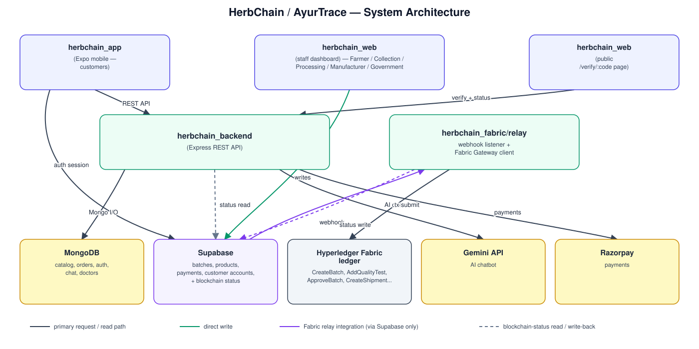
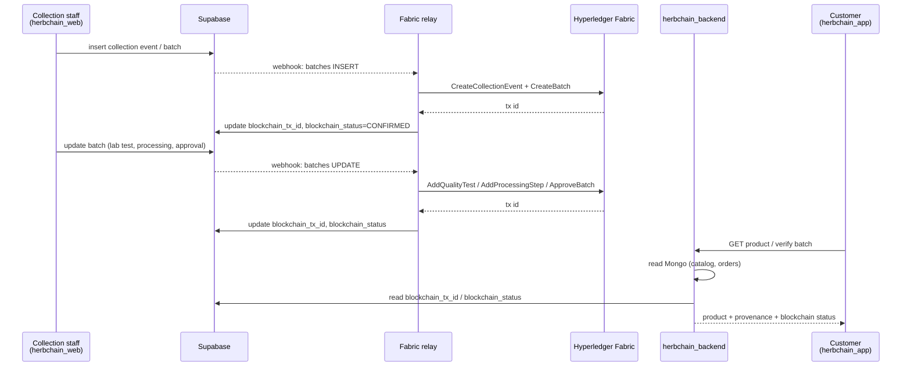

# Architecture diagrams

Supporting diagrams for [README.md](README.md). See that file for the
full written explanation of each subproject and how they connect.

## System architecture

Two independent write paths converge on Supabase, which doubles as the
shared "blockchain status" bulletin board between the web app and the
Fabric layer:

Key point: **`herbchain_web` and `herbchain_backend` never call the Fabric
relay directly**, and the relay never calls them back either. The relay
only reacts to Supabase Database Webhooks and writes its results onto the
same Supabase rows — so the blockchain layer can be turned on, off, or
rebuilt without touching either application. See
[`herbchain_fabric/README.md`](sss/herbchain_fabric/README.md) for the full
wiring diagram and current status (**built, not yet running end-to-end**
as of this writing).

## Data flow: one batch, farm to phone

